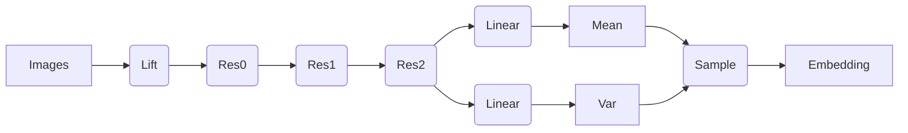
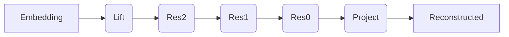

---
authors:
  - JingYu Ning

tags:
  - "VAE"
  - "Generative Model"
  - "Diffusion"
---

# Variational Autoencoder (VAE)

A tiny variational autoencoder (VAE) model to encode images into latent space for latent diffusion models (LDM) in crunch computing power.

#### 
[Repository (private)](https://jingyu.tplinkdns.com/gitea/Diffusion/vae)

## Implementation

In this implementation, I designed the vae using three residual blocks for both encoder and decoder.

In the encoder, I also added the squeeze-and-excitation mechanism in the trunk of the residual blocks to enhance the ability of feature extraction without dramatically increasing computational resources like attention does.

## Training

The pre-trained model on FFHQ 256x256 dataset can be found [here](https://jingyu.tplinkdns.com/gitea/Diffusion/vae/releases).
I use [NVIDIA TITAN Xp](https://www.nvidia.com/zh-tw/geforce/products/10series/star-wars-galactic-empire-titan-xp-collectors-edition/) with 12GB VRAM to train the model.
And use the mixed precision techniques with batch size `28` to maximize the usage of VRAM.
The learning rate is scheduled from `1e-4` to `0` using a cosine annealing schedule.

## Result

The VAE is training on FFHQ 256x256 dataset

| Original | Reconstructed |
|----------|---------------|
|  |  |
|  |  |

## Mask

To enable inpainting with LDM,
the encoder and decoder in this VAE are carefully designed so that a mask in pixel space can be easily mapped into latent space using simple steps like interpolation.
The decoder is able to understand masked images in latent space and can reconstruct the image correctly for both masked and unmasked areas in pixel space.

| Original | Target | Masked In Latent Space |
|----------|--------|------------------------|
|  |  |  |
|  |  |  |
